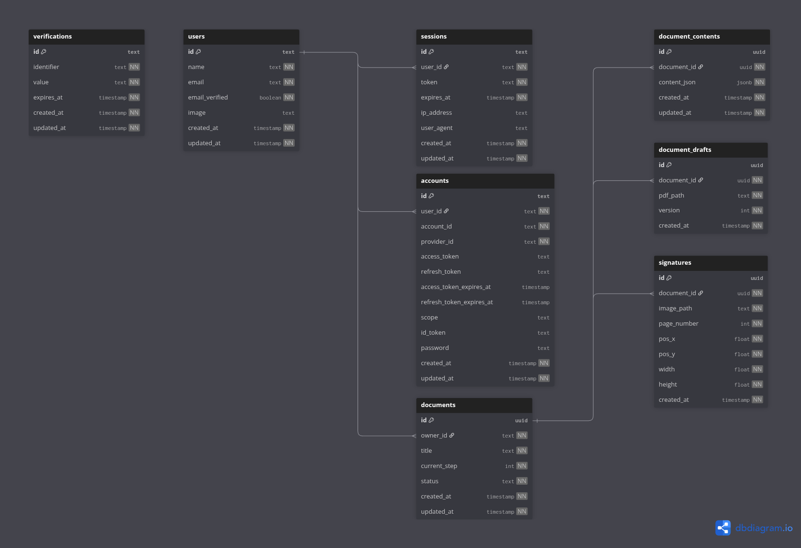

# Database Design

## Database Type

- PostgreSQL

## ERD



## DBML

```sql
///////////////////////////////////////////////////////////
// USER & SESSION
///////////////////////////////////////////////////////////

Table users {
  id              text        [pk]
  name            text        [not null]
  email           text        [not null, unique]
  email_verified  boolean     [not null]
  image           text
  created_at      timestamp   [not null, default: `now()`]
  updated_at      timestamp   [not null, default: `now()`]
}

Table sessions {
  id          text        [pk]
  user_id     text        [not null, ref: > users.id]
  token       text        [not null]
  expires_at  timestamp   [not null]
  ip_address  text
  user_agent  text
  created_at  timestamp   [not null, default: `now()`]
  updated_at  timestamp   [not null, default: `now()`]

  Indexes {
    (user_id)
  }
}

Table accounts {
  id                          text        [pk]
  user_id                     text        [not null, ref: > users.id]
  account_id                  text        [not null]
  provider_id                 text        [not null]
  access_token                text
  refresh_token               text
  access_token_expires_at     timestamp
  refresh_token_expires_at    timestamp
  scope                       text
  id_token                    text
  password                    text
  created_at                  timestamp   [not null, default: `now()`]
  updated_at                  timestamp   [not null, default: `now()`]

  Indexes {
    (provider_id) [unique]
    (user_id)
  }
}

Table verifications {
  id          text        [pk]
  identifier  text        [not null]
  value       text        [not null]
  expires_at  timestamp   [not null]
  created_at  timestamp   [not null, default: `now()`]
  updated_at  timestamp   [not null, default: `now()`]

  Indexes {
    (identifier)
  }
}

///////////////////////////////////////////////////////////
// DOCUMENT WORKFLOW
///////////////////////////////////////////////////////////

Table documents {
  id            uuid        [pk, default: `gen_random_uuid()`]
  owner_id      text        [not null, ref: > users.id]
  title         text        [not null]
  current_step  int         [not null, note: '1-4 workflow step']
  status        text        [not null, note: 'draft | signed']
  created_at    timestamp   [not null, default: `now()`]
  updated_at    timestamp   [not null, default: `now()`]

  Indexes {
    (owner_id)
  }
}

Table document_contents {
  id            uuid        [pk, default: `gen_random_uuid()`]
  document_id   uuid        [not null, ref: > documents.id]
  content_json  jsonb       [not null, note: 'Tiptap editor content']
  created_at    timestamp   [not null, default: `now()`]
  updated_at    timestamp   [not null, default: `now()`]

  Indexes {
    (document_id)
  }
}

///////////////////////////////////////////////////////////
// PDF & DRAFTS
///////////////////////////////////////////////////////////

Table document_drafts {
  id            uuid        [pk, default: `gen_random_uuid()`]
  document_id   uuid        [not null, ref: > documents.id]
  pdf_path      text        [not null]
  version       int         [not null]
  created_at    timestamp   [not null, default: `now()`]

  Indexes {
    (document_id, version) [unique]
  }
}

///////////////////////////////////////////////////////////
// SIGNATURES
///////////////////////////////////////////////////////////

Table signatures {
  id            uuid        [pk, default: `gen_random_uuid()`]
  document_id   uuid        [not null, ref: > documents.id]
  image_path    text        [not null]
  page_number   int         [not null]
  pos_x         float       [not null]
  pos_y         float       [not null]
  width         float       [not null]
  height        float       [not null]
  created_at    timestamp   [not null, default: `now()`]

  Indexes {
    (document_id)
  }
}

///////////////////////////////////////////////////////////
// ENUMS (LOGICAL)
///////////////////////////////////////////////////////////
//
// DocumentStatus
// - draft
// - signed
//
```
